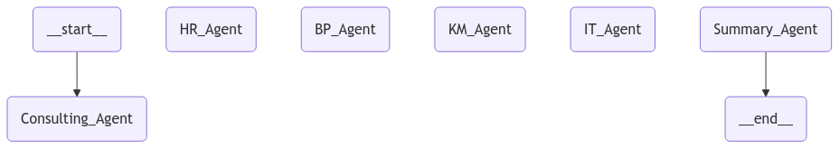
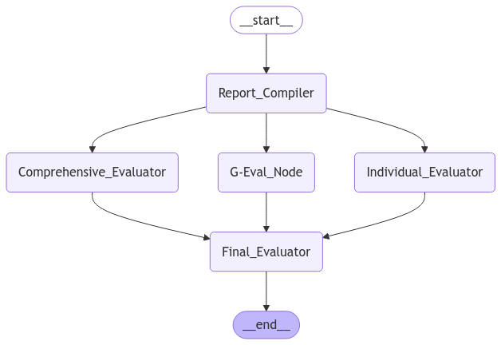

# Multi-Agent Architectures for Report Generation and Its Evaluation

This project focuses on creating, evaluating, and comparing three distinct architectures of multi-agent systems for generating and analyzing reports. The architectures implemented are:

1. **Supervisor**
2. **HierarchicalTeams**
3. **Network**

Once reports from these architectures are generated, an **Evaluator graph** is initiated to assess the outputs comprehensively.

## Project Structure

### Architectures

#### 1. Supervisor

The Supervisor architecture has a centralized controller ("Supervisor") responsible for delegating tasks to smaller topic-oriented teams and collecting their results to create the final report.


#### 2. Network

The Network architecture allows agents to operate in a decentralized manner, sharing information peer-to-peer and collaboratively generating a report.



#### 3. HierarchicalTeams

The HierarchicalTeams architecture organizes topic-oriented teams into subteams, each led by a team leader. The leaders report to a higher-level coordinator who synthesizes the results.


### EvaluatorGraph

The EvaluatorGraph evaluates the reports generated by all three architectures using structured metrics. 



The graph include nodes:
- **Individual Evaluation:** Each report is assessed independently.
- **Comprehensive Evaluation:** All reports are evaluated collectively.
- **Statistical Evaluation:** Textual and structural dependencies are analyzed for further insights.

Final node provides a comparative analysis of according to all reports and chooses the best architecture.

## How to Run the Project

1. Clone the repository:

   ```bash
   git clone https://github.com/baworista/LangChainDiploma.git
   cd LangChainDiploma
   ```

2. Install dependencies:

   ```bash
   pip install -r requirements.txt
   ```
   or
    ```bash
   conda install --file environment.yml
   ```

3. Run the desired architecture:

   - Supervisor:
     ```bash
     python graphSupervisor/graph.py
     ```
   - HierarchicalTeams:
     ```bash
     python graphHierarchicalTeams/graph.py
     ```
   - Network:
     ```bash
     python graphNetwork/graph.py
     ```

4. Start the EvaluatorGraph:

   ```bash
   python graphEvaluator/graph.py
   ```

## Results

The results from the EvaluatorGraph will be stored as `the_best_report_info.md` file as structured JSON files. The evaluation will include:

- Te best report chosen by the EvaluatorGraph.
- Short description of other reports.

## Contributing

Contributions are welcome! Please follow these steps:

1. Fork the repository.
2. Create a feature branch:
   ```bash
   git checkout -b feature-name
   ```
3. Commit your changes:
   ```bash
   git commit -m "Add new feature"
   ```
4. Push the branch:
   ```bash
   git push origin feature-name
   ```
5. Submit a pull request.

## License

This project is licensed under the MIT License. See the [LICENSE](LICENSE) file for details.

---

